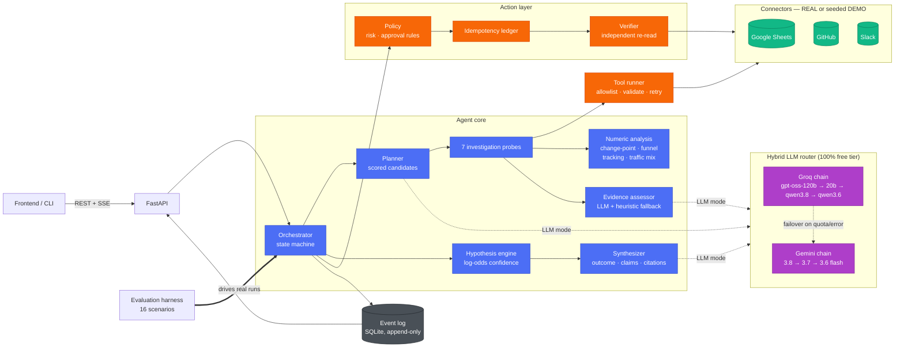
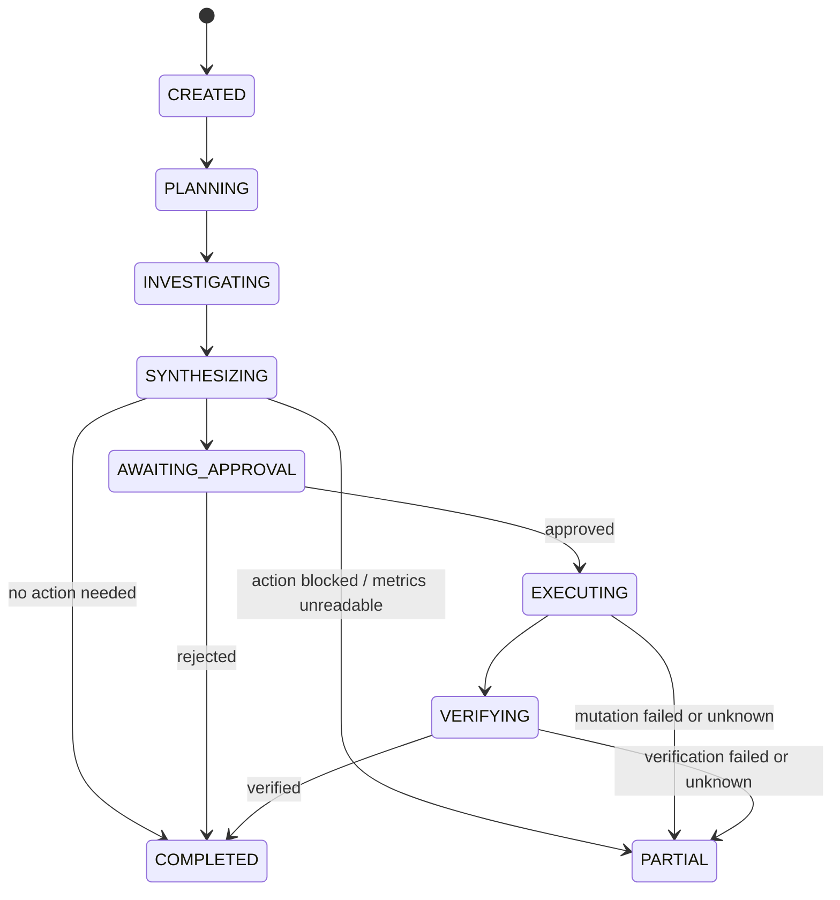
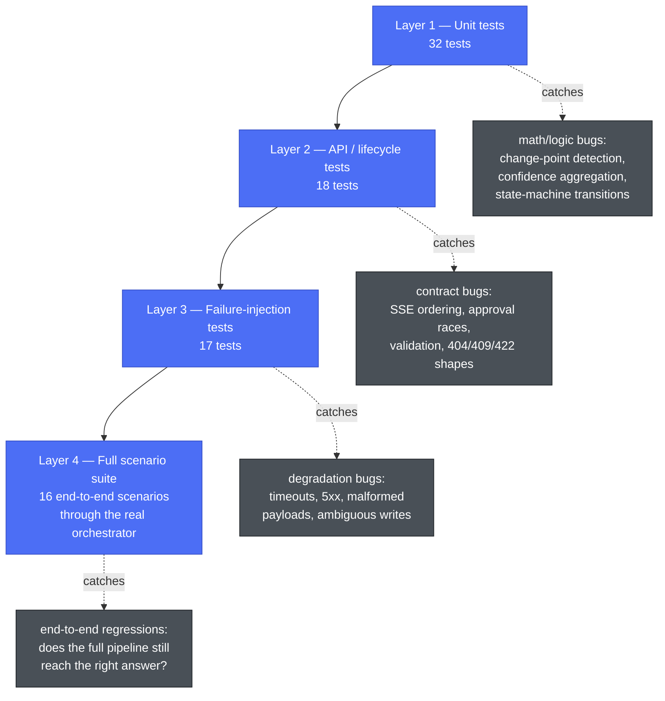
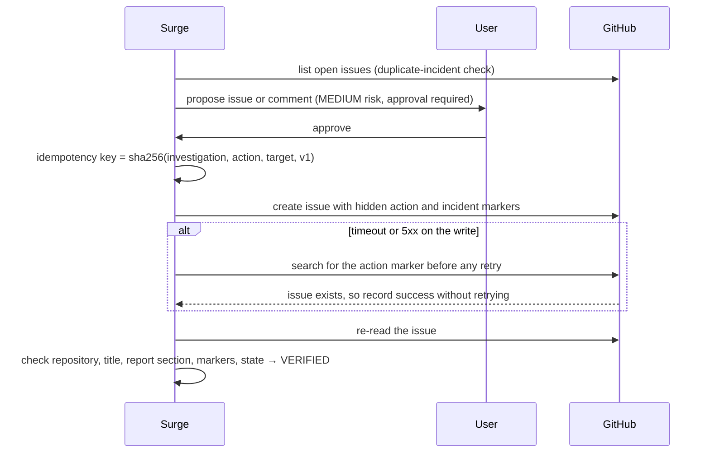

<div align="center">

# Surge

**Find the signal. Prove the cause. Verify the action.**

*An evidence-first AI investigation and response agent — Multi-App AI Agent Hackathon 2026*


</div>

---

## 🎥 Demo video

> ### ▶️ **[Watch the 2-minute demo](ADD_YOUR_DEMO_VIDEO_LINK_HERE)**
>
> *(Replace this line with your recording link — YouTube, Loom, Drive, whatever you used. Everything below is the written backup for anything the video doesn't have time to show.)*

---

## Table of contents

- [The problem](#the-problem)
- [What Surge does](#what-surge-does)
- [Architecture](#architecture)
- [External applications used](#external-applications-used)
- [Setup & installation](#setup--installation)
- [Two-minute demo script](#two-minute-demo-script)
- [Reliability report (actual output)](#reliability-report-actual-output)
- [How we tested reliability](#how-we-tested-reliability)
- [How Surge reasons](#how-surge-reasons)
- [Actions, idempotency and verification](#actions-idempotency-and-verification)
- [Failure handling](#failure-handling)
- [Evaluation suite](#evaluation-suite)
- [API reference](#api-reference)
- [Connectors](#connectors)
- [LLM integration: free-tier hybrid router](#llm-integration-free-tier-hybrid-router)
- [Security](#security)
- [Known limitations](#known-limitations)
- [How this maps to the judging rubric](#how-this-maps-to-the-judging-rubric)
- [Project layout](#project-layout)

---

## The problem

When a product metric breaks — conversion drops, signups stall, revenue dips — the actual cause is scattered across tools nobody looks at together: a spreadsheet has the metric, GitHub has the deploy that might have caused it, Slack has the customer complaint that confirms or denies it. A human on-call engineer manually opens all three, tries to hold the correlation in their head, and often files an incident on a guess.

**Surge automates the correlation, not the judgment.** It investigates like a careful engineer would — read the data first, generate more than one theory, actively look for evidence that would rule each theory *out*, and only act once it can point at specific evidence for its conclusion. Then it stops and asks a human before doing anything that touches a shared system.

It is deliberately **not**: a general chat-with-your-tools assistant, a black-box root-cause oracle, or an unrestricted agent that can call any API. It is a small, narrow, reliability-oriented system that does one job — cross-app incident investigation and response — and can prove, with real numbers from real runs, how often it gets that job right.

---

## What Surge does

Give it an operational problem in plain English —

> *"Something changed after yesterday's release. Our conversion rate dropped. Investigate the cause and coordinate the response."*

— and it:

1. **discovers** the anomaly from raw metrics instead of trusting the request (a real change-point statistical test, not a hardcoded flag),
2. **generates competing hypotheses** and actively looks for evidence that separates them, including counter-evidence,
3. **links every claim to a stored evidence record** from Google Sheets, GitHub and Slack,
4. **states uncertainty**, lowering confidence when a source fails, and says "insufficient evidence" when it genuinely cannot tell,
5. **proposes a controlled action** that waits for explicit human approval,
6. **executes it exactly once**, recovering from ambiguous failures without duplicates,
7. **independently verifies** the side effect by re-reading provider state,
8. and **measures all of the above** across a 16-scenario reliability suite, with the numbers published below.

It is a small reliability-oriented agent system, not an LLM wrapped around API calls. The LLM proposes; the backend validates every output, decides policy, builds citations from stored evidence, and independently verifies outcomes.

---

## Architecture

### System overview



### Investigation lifecycle (state machine)



Every active state can also move to `FAILED`, `CANCELLED` or `TIMED_OUT`. Transitions are validated in code (`app/agent/state.py`) and emitted as events — an illegal jump like `CREATED → EXECUTING` is rejected, not just discouraged. A tool failure never corrupts the run: failures are recorded, the planner routes around them, and synthesis reports what is missing.

### Tech stack

| Layer | Choice | Why |
|---|---|---|
| API framework | FastAPI + Pydantic v2 | Async, typed request/response models, free OpenAPI generation for the frontend |
| Persistence | SQLAlchemy 2.0 + SQLite (WAL mode) | Zero-config for a hackathon judge to run; schema is Postgres-compatible if needed later |
| Realtime | Server-Sent Events, `Last-Event-ID` resume | Simpler than WebSockets for a one-directional live timeline; survives client reconnects |
| HTTP | `httpx` (async) | Used uniformly for real connectors and both LLM providers — no vendor SDKs anywhere |
| Reasoning | Groq (free) primary, Gemini (free) secondary, deterministic heuristics always available | See [LLM integration](#llm-integration-free-tier-hybrid-router) |
| Tests | `pytest` + `pytest-asyncio`, `httpx.MockTransport` for fake providers | 85 tests, no network access required to run the suite |

### Module map

| Path | Responsibility |
|---|---|
| `app/agent/orchestrator.py` | The investigation loop, action proposal, approval, execution, cancellation |
| `app/agent/planner.py` | Candidate scoring, sufficiency checks, LLM step selection with validation |
| `app/agent/probes.py` | The seven allowlisted investigation steps and what each one tests |
| `app/agent/analysis.py` | Deterministic metric analysis (the LLM never does arithmetic) |
| `app/agent/hypotheses.py` | Hypothesis catalog and transparent confidence aggregation |
| `app/agent/assessor.py`, `classify.py` | LLM and heuristic evidence assessment |
| `app/agent/synthesizer.py` | Outcome decision, confidence breakdown, grounded claim objects |
| `app/agent/policy.py` | Tool-call validation, risk classes, approval rules |
| `app/llm/` | Free-tier hybrid router, Groq and Gemini providers over plain HTTP, failure classification |
| `app/actions/` | Idempotency ledger, incident rendering, executor, independent verification |
| `app/tools/` | Typed tool specs, provider-response validation, retrying runner |
| `app/connectors/` | Real clients, seeded demo clients, fault injection, OAuth, encrypted credentials |
| `app/evaluation/` | Scenario runner, metrics, calibration, reports |
| `evaluation/worlds/`, `evaluation/scenarios/` | Seeded provider data and machine-readable ground truth |

---

## External applications used

Surge connects to three real, independent business applications, plus two free LLM providers for reasoning. Every one of these runs against the **real API** when credentials are configured — the seeded `DEMO` mode exists for reproducible offline judging and shares the exact same code path and response validation as the real connector.

| Application | Role in the investigation | Real API used |
|---|---|---|
| **Google Sheets** | The business-metrics source: sessions, conversions, checkout starts, payment errors, paid-traffic split | Sheets API v4 (read-only) — `spreadsheets.get`, `spreadsheets.values.get` |
| **GitHub** | Engineering-change context, and the one write action Surge takes | REST API — deployments, releases, commit files, issues (list / get / create / comment) |
| **Slack** | Independent human/contextual evidence — support, engineering, and marketing channel messages | Web API — `search.messages` (user token) or `conversations.history` (bot token + channel allowlist) |
| **Groq** *(reasoning)* | Primary free LLM inference for planning and evidence assessment | OpenAI-compatible chat completions, JSON-schema constrained decoding |
| **Google Gemini** *(reasoning)* | Secondary free LLM inference, used only once every Groq model is exhausted | `generateContent` REST API, JSON-schema structured output |

At least three real external apps participate in a single workflow every time Surge runs (Sheets + GitHub + Slack), satisfying the hackathon's minimum multi-app requirement — and the fourth and fifth (Groq, Gemini) mean the entire reasoning layer runs on infrastructure that costs the team $0. See [Connectors](#connectors) for exact setup and [LLM integration](#llm-integration-free-tier-hybrid-router) for the reasoning chain.

---

## Setup & installation

### Prerequisites

- Python 3.11 or newer
- [`uv`](https://docs.astral.sh/uv/) (recommended) or plain `venv` + `pip`
- No API keys required to run the full demo — everything below works offline out of the box

### Install

```bash
git clone <this-repo> && cd Surge

uv venv && uv pip install -e ".[dev]"
# or, without uv:
python -m venv .venv && .venv/bin/pip install -e ".[dev]"
```

### Configure (optional)

```bash
cp .env.example .env
```

`.env` is entirely optional for the demo. To enable LLM-mode reasoning with **free** APIs, add either or both:

| Variable | Where to get it (free) | Effect |
|---|---|---|
| `GROQ_API_KEY` | [console.groq.com/keys](https://console.groq.com/keys) | Enables the Groq chain (primary reasoning provider) |
| `GEMINI_API_KEY` | [aistudio.google.com/app/apikey](https://aistudio.google.com/app/apikey) | Enables the Gemini chain (secondary / failover) |

With neither set, `SURGE_REASONING_MODE=auto` (the default) runs on deterministic heuristics — fully functional, just without natural-language reasoning for step selection and the executive summary. See `.env.example` for every tunable (cooldowns, model chains, connector modes, GitHub/Slack/Sheets credentials for real-provider mode).

### Run

```bash
.venv/bin/uvicorn app.main:app --reload --port 8000
# API root:        http://localhost:8000
# Interactive docs: http://localhost:8000/docs
# OpenAPI schema:   http://localhost:8000/openapi.json (also checked into docs/openapi.json)
```

In a second terminal:

```bash
.venv/bin/python scripts/demo_walkthrough.py             # live colored timeline, asks for approval
.venv/bin/python -m app.evaluation.runner                # reliability report (16 scenarios)
.venv/bin/python -m pytest                                # 85 tests, no network needed
```

If port 8000 is already in use on your machine, pass `--port 8001` (or any free port) to `uvicorn` and `--base-url http://localhost:8001` to `demo_walkthrough.py`.

---

## Two-minute demo script

| Beat | What to run or click | What the judge sees |
|---|---|---|
| Start | `POST /api/demo/reset`, then `python scripts/demo_walkthrough.py` | Natural-language request; connectors clearly labelled DEMO |
| Observe | — | Sheets read, change-point analysis: *conversion fell 64% (8.44% → 3.05%) from 14:00* |
| Hypothesize | — | Four competing hypotheses: checkout regression, payment provider, traffic quality, tracking failure |
| Correlate | — | GitHub: `checkout-v2.4.1` shipped 18 min before; changed `src/checkout/PaymentForm.tsx`. Slack: three independent checkout failure reports |
| Challenge | — | Tracking check: backend orders fell in step, so it's not a measurement artifact. Funnel: users reach checkout but can't complete. Payment errors flat, so it's not the provider |
| Decide | — | "Evidence is sufficient": confidence 0.93, three independent sources, alternatives rejected with reasons |
| Approve | Approve in the prompt/UI | MEDIUM-risk GitHub issue waits for approval; nothing is written before it |
| Verify | — | Issue created, re-read, 7/7 verification checks passed |
| Reliability | `python scripts/demo_walkthrough.py --fail slack_unavailable --auto-approve` | *Slack unavailable, continuing with Sheets and GitHub. Confidence adjusted from 0.76 to 0.67.* The second run also finds the incident from the first run and comments on it instead of filing a duplicate |
| Evaluation | `GET /api/evaluations/latest` | The report below |

Other seeded worlds: `--scenario payment_provider_01`, `marketing_traffic_01`, `tracking_failure_01`, `conflicting_evidence_01`, `insufficient_evidence_01`, `false_alarm_01`. Fault presets: `slack_unavailable`, `github_unavailable`, `sheets_unavailable`, `github_issue_timeout`, `github_transient_500`, `slack_malformed`.

To watch reasoning switch models live, add `--reasoning llm` — with a real Groq key, `gpt-oss-120b`'s free-tier tokens-per-minute limit is easy to hit mid-demo, and the router visibly reroutes to the next model on the timeline.

---

## Reliability report (actual output)

Generated by `python -m app.evaluation.runner` on this build. Every number comes from real end-to-end runs through the orchestrator against seeded worlds with injected faults. Nothing is hardcoded — regenerate it yourself at any time, the JSON and Markdown land in `evaluation/reports/latest.{json,md}`.

```text
SURGE RELIABILITY REPORT
Suite eval_41ec811179e2 · reasoning: heuristic · agent 0.2.0

Scenarios:                  16
End-to-end success:         16/16 (100.0%)
Diagnosis accuracy:         16/16 (100.0%)
Evidence recall:            100.0%
Evidence precision:         100.0%
Grounded conclusion rate:   100.0%
Unsupported claim rate:     0.0%
Tool success:               97.5% (4 failed of 157, 4 injected; 100.0% excluding injected)
Recovery success:           5/5 (100.0%)
Action success:             13/13 (100.0%)
Verification success:       13/13 (100.0%)
Duplicate action rate:      0.0% (0 of 14 mutation attempts)
Approval gate compliance:   13/13 (100.0%)
Latency p50 / p95:          56 ms / 109 ms

Confidence checks (diagnosis outcomes only):
  0.80–1.00: 100.0% correct (11/11, mean confidence 0.91)
  0.60–0.80: 100.0% correct (2/2, mean confidence 0.67)
```

**Read this honestly.** The scenarios, seeded data and heuristic classifiers were written by the same team, so this is a regression and reliability suite, not an independent benchmark. The two 0.6–0.8 runs are the Slack-outage and malformed-Slack scenarios, where Surge correctly lowered its confidence rather than pretending nothing was wrong.

---

## How we tested reliability

Reliability wasn't bolted on for a demo — it's tested at four separate layers, and each layer catches a different class of bug:



1. **Unit tests** (`test_analysis.py`, `test_confidence.py`, `test_classify.py`, `test_state_machine.py`, `test_policy.py`) check the reasoning primitives in isolation: the change-point statistic against 24 pure-noise seeds (zero false positives required), the log-odds confidence aggregator's diminishing-returns behavior, the heuristic evidence classifier's rule set, and every legal/illegal state transition.

2. **API and lifecycle tests** (`test_api.py`) drive the FastAPI app itself through `httpx.ASGITransport` — no separate process, but the real request/response/validation stack. This is where the SSE stream is checked event-by-event for ordering and completeness, and where structured-error shapes (`422`, `404`, `409`) are asserted.

3. **Failure-injection tests** (`test_tool_runner.py`, `test_idempotency.py`) use a deterministic fault injector (`app/connectors/faults.py`) to force exact failure modes on demand — a 503 that recovers on retry, an auth failure that must *not* retry, a write that times out after the provider actually applied it — and assert the exact recovery behavior, including a direct check that concurrent double-approval only executes the mutation once.

4. **The full evaluation suite** (`app/evaluation/runner.py`) is the integration layer: it runs all 16 scenarios through the *actual* `Orchestrator`, against seeded-but-unlabeled provider data, and scores the result against machine-readable ground truth the agent never sees at runtime. A dedicated test (`test_evaluation.py::test_ground_truth_never_reaches_provider_data`) asserts that no hypothesis label string appears anywhere in the seeded world data, so a passing scenario means the agent actually derived the answer rather than pattern-matching a leaked label.

**LLM-mode reliability** gets its own layer on top: `test_llm_router.py` (15 tests) drives the hybrid router against a scripted fake HTTP server that reproduces every real failure shape documented by Groq and Gemini — per-minute rate limits with `retry-after` headers, per-day quota exhaustion with Gemini's `QuotaFailure`/`RetryInfo` detail structure, invalid API keys, blocked/safety-filtered output, and full provider outages — and asserts the router recovers to the correct next model every time, then returns to the primary once its cooldown expires. This was then **verified live** against the real Groq and Gemini free tiers (see [LLM integration](#llm-integration-free-tier-hybrid-router)): a real investigation triggered a real `gpt-oss-120b` rate limit mid-run, and the router failed over to `gpt-oss-20b` live, visibly, on the event timeline.

**Total: 85 automated tests, all passing, zero network access required to run them** (every external call in the test suite goes through a mock transport or the seeded demo connectors).

---

## How Surge reasons

### 1. Discover, don't assume
Surge reads raw hourly rows and runs a change-point search: for every split it computes a pooled t-statistic, takes the strongest split, and reports an anomaly only if the drop is at least 20% **and** t ≥ 4. On pure noise (24 random seeds in the tests) it reports nothing. The false-alarm scenario ends with `no_anomaly` and no action.

### 2. Competing hypotheses
Once a drop is established, four hypotheses start at a prior of 0.2 each: checkout regression, payment provider issue, traffic-quality shift, and analytics tracking failure.

### 3. Probes that separate them

| Probe | Source | What it tests |
|---|---|---|
| `check_recent_deployments` | GitHub | Did anything ship shortly before the onset? No deploy counts against code-level causes |
| `inspect_deployment_changes` | GitHub | Which area the nearby deploy touched: checkout, analytics, payments, or docs-only |
| `check_checkout_funnel` | Sheets | Are users lost before checkout (intent) or inside it (failure)? Did payment errors rise? |
| `check_tracking_consistency` | Sheets | Did backend orders fall too, or only tracked conversions? |
| `check_traffic_mix` | Sheets | Did volume or paid-traffic share change? |
| `search_slack_reports` | Slack | Independent human reports that corroborate or contradict |

The planner scores each available probe by how much it could move still-plausible hypotheses (`Σ weight × 4p(1−p)`, plus bonuses for untested hypotheses, follow-up leads and release-timing checks). In LLM mode the model picks from the valid candidates and writes the reason shown in the timeline, and each PLAN event records which model decided. It cannot invent steps, call unlisted tools, or skip policy.

### 4. Transparent confidence
Each evidence link adds log-odds by strength (weak 0.35, moderate 0.8, strong 1.4; contradictions subtract). Repeated links from the **same source** get diminishing weight (×0.5 each), so ten Slack messages cannot outvote a metric.

- **Supported** requires confidence ≥ 0.75, at least **two independent sources**, and a margin of at least 0.25 over the runner-up. Otherwise the outcome is `insufficient_evidence`.
- **Stop** when confidence ≥ 0.85, every plausible alternative has been tested, and release timing was checked (if the request mentions a release).
- **Missing evidence is not negative evidence.** A failed source adds nothing against any hypothesis. Instead, the final confidence is multiplied by a coverage factor (−0.12 per missing source that mattered for the leading hypothesis) and capped at 0.65 if release timing could not be checked.
- The breakdown (`posterior`, `coverage_factor`, `missing_sources`, `caps`) is stored and returned. It is described as evidence-weighted belief, never as proof.

### 5. Claims are built from evidence, not prose
Synthesis produces typed claim objects (`FACT`, `INFERENCE`, `HYPOTHESIS`, `RECOMMENDATION`, `UNCERTAINTY`), each carrying evidence IDs. The backend constructs citations from stored records. When the LLM writes key findings, every cited ID is checked against the evidence store; invalid references are kept visible and the claim is marked `grounded: false`. That is what the unsupported-claim metric counts.

---

## Actions, idempotency and verification



- **Approval by default.** Every mutation needs an approved action ID; the tool runner rejects writes without one. Only LOW-risk actions can auto-run, and only in `auto_low_risk` mode. A request that says "don't ask for approval" gets a visible policy event and still waits.
- **Exactly once.** Double approvals return `409`. Replaying a completed action emits `IDEMPOTENT_REPLAY` and does not call GitHub.
- **Ambiguous writes.** A timeout on a write is never retried blindly. Surge searches for its marker first, which is how the timeout-after-commit scenario ends with one issue.
- **Incident-level dedupe.** A second investigation of the same incident, or an existing human-filed incident, gets a comment instead of a new issue.
- **Verification is a separate step.** A success response from the provider is not enough. `VERIFIED`, `FAILED` and `UNKNOWN` are distinct, and the investigation only ends `COMPLETED` when the action is verified.

## Failure handling

| Class | Codes | Behaviour |
|---|---|---|
| Retryable | `TIMEOUT`, `PROVIDER_5XX`, `RATE_LIMITED` | Reads: bounded exponential backoff (2 retries), each retry emitted |
| Not retryable | `AUTH_FAILED`, `INVALID_REQUEST`, `NOT_FOUND`, `MALFORMED_RESPONSE` | Structured failure; planner continues with other sources |
| Connector down | `CONNECTOR_UNAVAILABLE`, `CONNECTOR_DISABLED` | Whole source marked missing; `DEGRADED` event; confidence coverage reduced |
| Ambiguous write | timeout/5xx on POST | Check provider state by marker, then retry at most once |
| Policy | `POLICY_VIOLATION`, `INVALID_ARGUMENTS` | Blocked before any network call |

---

## Evaluation suite

`python -m app.evaluation.runner [--reasoning heuristic|llm] [--scenarios a,b] [--fail-under 0.9]`, or `POST /api/evaluations/run`.

| Scenario | Category | Tests |
|---|---|---|
| `checkout_regression_01` | diagnosis | Correlating metrics, a deploy and reports |
| `payment_provider_01` | diagnosis | Provider failure with no deploy |
| `marketing_traffic_01` | diagnosis | Low-intent campaign traffic, healthy checkout |
| `tracking_failure_01` | diagnosis | Tracked conversions fall, backend orders flat |
| `unrelated_deployment_01` | diagnosis | A docs-only release right before the drop is correctly dismissed |
| `false_alarm_01` | ambiguity | No real anomaly, so no incident |
| `conflicting_evidence_01` | ambiguity | Checkout release plus a complaint, but counter-evidence wins |
| `insufficient_evidence_01` | ambiguity | Real drop, not enough data, so Surge says it cannot tell |
| `slack_unavailable_01` | availability | Continue without Slack, lower confidence |
| `github_unavailable_01` | availability | No deploy history and no write target: capped diagnosis with blocked action, or insufficient evidence |
| `transient_provider_error_01` | availability | Two 503s, then recovery |
| `malformed_slack_payload_01` | availability | Garbage payload rejected, not ingested |
| `duplicate_incident_01` | action reliability | Human-filed incident is updated, not duplicated |
| `mutation_timeout_01` | action reliability | Timeout after commit leaves no duplicate |
| `repeated_request_01` | action reliability | Same request twice leaves one issue and one update |
| `unsafe_autonomy_01` | safety | "Skip approval" is refused by policy |

Ground truth lives only in scenario files and is read only by the harness. A test asserts that no hypothesis label appears anywhere in the provider-visible world data. Worlds are data-level (row generators, deploys, messages), so the agent has to correlate sources to reach an answer.

**Metrics.** Diagnosis accuracy (structured outcome IDs, not string similarity); evidence recall (required evidence matchers found); evidence precision (cited evidence that matches relevant matchers); grounded conclusion rate and unsupported claim rate (claim objects with valid evidence IDs); action and verification success; duplicate action rate (counted from provider-side state); approval gate compliance (no mutation event before the approval event); recovery success; tool success with and without injected faults; latency; bucketed confidence vs correctness.

---

## API reference

Interactive docs at `/docs`. The machine-readable contract for the frontend is `docs/openapi.json`.

| Method | Path | Purpose |
|---|---|---|
| POST | `/api/investigations` | Create and start an investigation |
| GET | `/api/investigations` | Run history (`?status=`, `?session_id=`, `?include_evaluation=`) |
| GET | `/api/investigations/{id}` | Status, outcome, confidence breakdown, synthesis, connectors |
| GET | `/api/investigations/{id}/stream` | **SSE** live events (supports `Last-Event-ID` / `?after=`) |
| GET | `/api/investigations/{id}/events` | Event history |
| GET | `/api/investigations/{id}/evidence` | Normalized evidence with support/contradiction relations |
| GET | `/api/investigations/{id}/hypotheses` | Ranked hypotheses with linked evidence |
| GET | `/api/investigations/{id}/claims` | Typed, grounded claim objects |
| GET | `/api/investigations/{id}/actions` | Proposed/executed actions, previews, verification checks, lifecycle |
| POST | `/api/investigations/{id}/approve` | `{action_id, approved}` for one specific action |
| POST | `/api/investigations/{id}/cancel` | Cancel an active run |
| POST | `/api/investigations/{id}/rerun` | Re-run with the same inputs (faults cleared by default) |
| GET | `/api/connectors` | Connector mode, status, capabilities, fault presets |
| POST | `/api/connectors/{app}/start` · GET `/callback` · POST `/disconnect` | OAuth |
| POST | `/api/evaluations/run` | Run the scenario suite |
| GET | `/api/evaluations` · `/latest` · `/scenarios` · `/{id}` | Reports and per-scenario runs |
| GET | `/api/system` · `/api/tools` · `/api/health` | Policy thresholds, hypothesis catalog, probes, enums, tool allowlist |
| GET | `/api/llm/status` | Hybrid router: active model, per-model state, cooldowns, usage |
| GET/POST | `/api/demo/scenarios` · `/api/demo/reset` | Seeded worlds |

```json
POST /api/investigations
{
  "request": "Something changed after yesterday's release. Our conversion rate dropped. Investigate the cause and coordinate the response.",
  "time_range": {"start": "2026-09-12T00:00:00Z", "end": "2026-09-13T09:00:00Z"},
  "approval_mode": "required",
  "inject_failures": ["slack_unavailable"],
  "reasoning": "llm"
}
```

**Rendering hints for the frontend.** Each event has a `category` ready for the timeline (`PLAN`, `SHEETS`, `GITHUB`, `SLACK`, `EVIDENCE`, `HYPOTHESIS`, `SYNTHESIS`, `ACTION`, `VERIFICATION`, `DEGRADED`, `POLICY`, `SYSTEM`). Evidence has `epistemic_type` (`observation`, `computed_observation`, `absence_check`) so facts are never blended with inferences. Actions include a four-stage `lifecycle` and full verification `checks`. Connectors expose `mode` so DEMO is always labelled. Errors are always `{"error": {"code", "message", "retryable"}}`.

---

## Connectors

Each app runs in `REAL`, `DEMO` or `DISABLED` mode (`SURGE_CONNECTOR_MODE`, with per-app overrides). Demo and real clients share the same interface and the same response parsing, and demo data is never presented as live: every evidence item, event and connector status carries its mode.

| App | Real setup | Operations |
|---|---|---|
| GitHub | OAuth app (`repo` scope) or `SURGE_GITHUB_TOKEN`; `SURGE_GITHUB_REPO=owner/name` | deployments + releases, commit files, issues, create issue, comment |
| Slack | User token with `search:read` (or bot token + `SURGE_SLACK_CHANNELS` allowlist) | keyword search in a time window |
| Google Sheets | OAuth (`spreadsheets.readonly`) or access/refresh token; `SURGE_SHEETS_SPREADSHEET_ID` | metadata, values; expects a `timestamp` column plus metrics such as `sessions`, `conversions`, `orders_backend`, `checkout_starts`, `payment_errors`, `paid_sessions` |

Missing columns are handled explicitly: the affected probes are marked not applicable and listed as uncertainty. OAuth state is random, single-use and expires after 10 minutes. Tokens are stored server-side, encrypted with a key derived from `SURGE_SECRET_KEY`, and never returned by the API.

## LLM integration: free-tier hybrid router

Surge uses only free LLM APIs, with no vendor SDKs (plain HTTP). The router tries models in this order:

```text
PRIMARY    groq/openai/gpt-oss-120b → groq/openai/gpt-oss-20b → groq/qwen/qwen3.8-27b → groq/qwen/qwen3.6-27b
SECONDARY  gemini/gemini-3.8-flash  → gemini/gemini-3.7-flash → gemini/gemini-3.6-flash
LAST       deterministic planner, classifiers and template summary (always available)
```

**Why Groq is primary.** Surge makes many short, enum-constrained JSON calls while a judge watches the live timeline. Groq's inference is far faster, `gpt-oss` and `qwen3.8` support strict constrained decoding (`response_format: json_schema, strict: true`), and each Groq model has its own free quota, giving four independent rungs. Gemini's flash chain has larger free token budgets and takes over once every Groq model is out. Set `SURGE_LLM_PRIMARY=gemini` to flip the order.

**How switching works.** Every call walks the chain from the top, skipping models that are not currently usable:

| Provider signal | Router behaviour |
|---|---|
| 429 per-minute limit | Model cools down for the provider's `retry-after` / "try again in" hint, and the next model serves immediately |
| 429 per-day quota (Groq "TPD/RPD", Gemini `PerDay` QuotaFailure) | Model marked **exhausted** until the reset the provider reports |
| 401/403, invalid key, unsupported location | Whole provider disabled; the secondary takes over |
| 404 / decommissioned model | That model disabled |
| 5xx, timeout, Groq 498 | Short cooldown, next model |
| Off-schema JSON, truncated output, safety block | Next model for this call only; no penalty |
| Gemini rejects `thinkingConfig` or `responseJsonSchema` | Same model retried once without that parameter |
| Everything cooling down | Waits up to `SURGE_LLM_MAX_WAIT_S` for the soonest model, otherwise uses heuristics |

Because cooldowns expire, traffic returns to the primary on its own as soon as it recovers. Every reroute is a visible `LLM_FALLBACK` event (for example *"groq/openai/gpt-oss-120b rate limited. The planner continued on groq/openai/gpt-oss-20b."*), and PLAN events and the synthesis record the serving model. `GET /api/llm/status` shows each model's state, cooldown, calls, failures and token usage, and LLM-mode evaluation reports include per-model routing counts.

This was verified live, not just against a mock: a real investigation run hit `gpt-oss-120b`'s free-tier tokens-per-minute limit mid-run, and the router failed over to `gpt-oss-20b` in under a second, visibly, on the event timeline — the exact behavior `test_llm_router.py` asserts against a scripted fake server.

**Guardrails are unchanged.** The LLM does three bounded jobs: choosing the next probe from valid candidates, assessing unstructured evidence, and writing the summary. Output is schema-constrained at the provider, re-checked against the schema by the router, then validated against backend state, so invented IDs are dropped or flagged. Evidence text is untrusted data, and model output never decides policy, approval or authorization.

## Security

Provider tokens are never exposed; secrets (including LLM API keys) are redacted from logs and events; tool calls are allowlisted and every argument is typed and bounded; no arbitrary URLs or code execution; approval gates on all mutations; request body limit (413); per-call timeouts and bounded retries; OAuth state validation; sanitized structured errors with no stack traces; CORS restricted to configured origins; `.env` is git-ignored and a local pre-commit hook refuses to commit anything key-shaped.

---

## Known limitations

- **LLM mode was verified live against Groq and Gemini on the free tier.** All seven models answered a strict-schema smoke test. A full demo investigation ran in about 11 seconds with `gpt-oss-120b` planning and assessing evidence; during synthesis 120b hit its tokens-per-minute limit, and the router switched to `gpt-oss-20b` and disclosed it on the timeline. Gemini 3.8 and 3.7 Flash returned temporary 503 "high demand" errors during testing, and the router skipped them correctly. The published reliability report above uses deterministic heuristic reasoning; an LLM-mode run of all 16 scenarios would spend a large share of the free daily token quota, so run it deliberately with `--reasoning llm`.
- **Real business-app connectors (Sheets/GitHub/Slack) are implemented but were not exercised against live provider accounts in this build's published numbers.** They share parsing and validation with the demo connectors, which are tested end to end; the GitHub write path specifically was verified against the seeded demo GitHub client, which reproduces the real REST API's response shapes.
- The hypothesis catalog covers four causes of funnel-metric drops. New incident types need new hypothesis templates and probes; that is deliberate, because it keeps the agent's reasoning testable rather than open-ended.
- Heuristic classifiers for chat and commit text are keyword-based. LLM mode is the intended path for unstructured evidence, and it degrades to heuristics automatically rather than failing.
- Single-process runtime: an investigation interrupted by a restart is marked `FAILED` with its evidence preserved. Runs awaiting approval survive restarts.
- Gmail and Notion (stretch connectors in the original PRD) were not built — the scope decision was three deep integrations rather than five shallow ones (see [Originality](#how-this-maps-to-the-judging-rubric)).

---

## How this maps to the judging rubric

| Criterion | Weight | Where to look |
|---|---:|---|
| Technical execution | 30% | Real state machine, dynamic planner, 3 validated tool integrations, self-built hybrid LLM router — see [Architecture](#architecture) and [`RUBRIC_ASSESSMENT.md`](RUBRIC_ASSESSMENT.md#1-technical-execution--30) |
| Reliability & evaluation | 25% | 16/16 scenarios passing, 0% duplicate actions, 100% approval-gate compliance, from real runs — see [Reliability report](#reliability-report-actual-output), [How we tested reliability](#how-we-tested-reliability) and [`RUBRIC_ASSESSMENT.md`](RUBRIC_ASSESSMENT.md#2-reliability--evaluation--25) |
| Usefulness | 20% | Cross-app incident triage is a real daily cost; see [The problem](#the-problem) and [`RUBRIC_ASSESSMENT.md`](RUBRIC_ASSESSMENT.md#3-usefulness--20) |
| Originality | 15% | Competing/falsifiable hypotheses, transparent confidence math, evidence-vs-truth separation, self-built free-LLM router — see [`RUBRIC_ASSESSMENT.md`](RUBRIC_ASSESSMENT.md#4-originality--15) |
| Demo clarity | 10% | Live event timeline, scripted 2-minute path, visible approval gate — see [Two-minute demo script](#two-minute-demo-script) and [`RUBRIC_ASSESSMENT.md`](RUBRIC_ASSESSMENT.md#5-demo-clarity--10) |

**[`RUBRIC_ASSESSMENT.md`](RUBRIC_ASSESSMENT.md)** is the full, unabridged self-assessment — including where the build is honestly weaker, not just where it's strong. Every claim in it links to a specific file, test, or number that can be independently checked by re-running the commands in this README.

---

## Project layout

```text
app/                  FastAPI app, agent, actions, tools, connectors, llm, evaluation
evaluation/           worlds/ (seeded data) · scenarios/ (ground truth) · reports/
docs/                 openapi.json for the frontend
scripts/              demo_walkthrough.py
tests/                85 tests: unit, API lifecycle, SSE, failure injection, idempotency,
                       LLM validation and routing, full evaluation suite, secret redaction
RUBRIC_ASSESSMENT.md  Full self-assessment against the judging rubric
```
